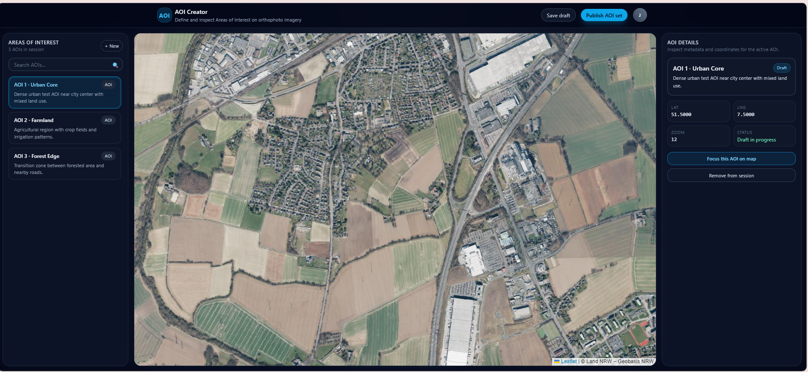
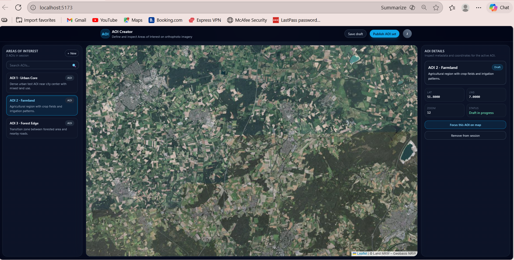
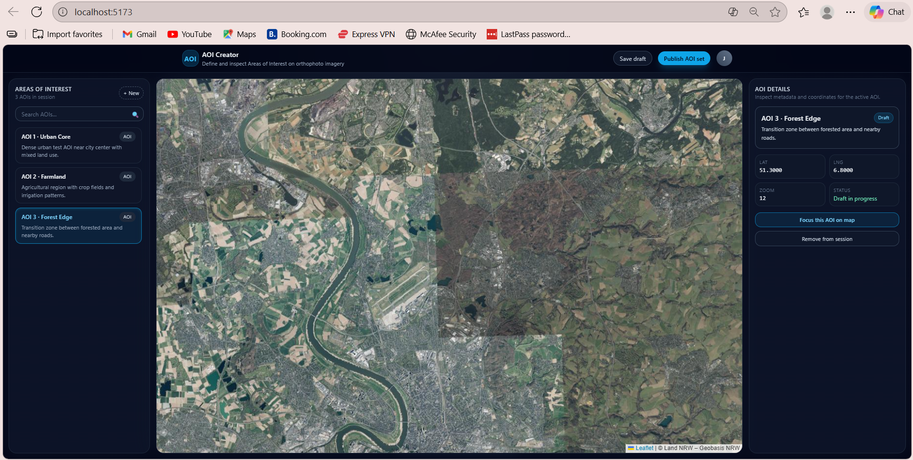
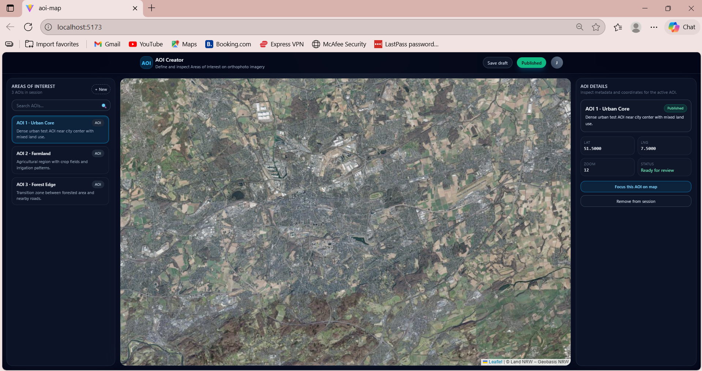

# AOI Map Creator

Single-page React + TypeScript application for creating and managing Areas of Interest (AOIs) on top of a WMS satellite imagery layer.

## Stack

- React + TypeScript + Vite
- Tailwind CSS
- Leaflet + react-leaflet (map + WMS)
- Playwright (end-to-end tests)

---

## Map Library Choice

I chose **Leaflet + react-leaflet** because:

- Very mature ecosystem with good **WMS support** out of the box.
- Easy React integration via `react-leaflet` with declarative components.
- Lightweight and well-suited for 2D web maps without requiring WebGL.

Alternatives considered:

- **MapLibre GL** – great for vector tiles and WebGL performance, but more setup for WMS and overkill for a single-layer satellite viewer.
- **OpenLayers** – powerful and flexible, but higher learning curve and more verbose API.
- **react-map-gl** – optimized for Mapbox-style vector maps; less ideal for this WMS-focused use case.

---


## Architecture

High-level structure:

- `src/main.tsx` – React root, Tailwind + Leaflet CSS imports.
- `src/App.tsx` – Page layout, global AOI state, passes props to children.
- `src/components/Header.tsx` – Top bar / app title.
- `src/components/Sidebar.tsx` – List of AOIs, handles AOI selection.
- `src/components/RightPanel.tsx` – Shows details for currently selected AOI.
- `src/components/MapPanel.tsx` – Leaflet map, WMS layer, keeps view synced with selected AOI.

State:

- `App.tsx` stores:
  - `aois`: static list of AOIs (id, name, description, center, zoom).
  - `selectedAoiId`: currently active AOI.
- `Sidebar` updates `selectedAoiId`.
- `RightPanel` and `MapPanel` receive the selected AOI as props.

---

## Data Model / Schema (ER Overview)

Conceptual entities (future backend):

### AOI

| Field       | Type           | Description                          |
|------------|----------------|--------------------------------------|
| id         | string         | Unique AOI id                        |
| name       | string         | Human-readable name                  |
| description| string         | Text description                     |
| center     | [number,number]| Map center (`[lat, lng]`)           |
| zoom       | number         | Preferred zoom level                 |

### Layer

| Field   | Type   | Description                     |
|---------|--------|---------------------------------|
| id      | string | Unique id                      |
| name    | string | Display name                   |
| type    | string | e.g. `"wms"`, `"vector"`       |
| visible | boolean| Whether layer is currently on  |

### Feature (for drawn geometries, future)

| Field      | Type     | Description                    |
|------------|----------|--------------------------------|
| id         | string   | Unique id                      |
| aoiId      | string   | AOI this feature belongs to    |
| geometry   | GeoJSON  | Point / LineString / Polygon   |
| createdAt  | Date     | Creation timestamp             |

---

## Application UI Preview





## AOI Selection + Map Movement


## ✔ Playwright Test Results


## API Documentation (future/backend design)

The current version uses static in-memory data, but it is structured to align with a future REST API.

Example routes:

### `GET /api/aois`

Returns the list of AOIs.

```json
[
  {
    "id": "aoi-1",
    "name": "AOI 1",
    "description": "Urban area – test AOI near city center.",
    "center": [51.5, 7.5],
    "zoom": 11
  }
]
